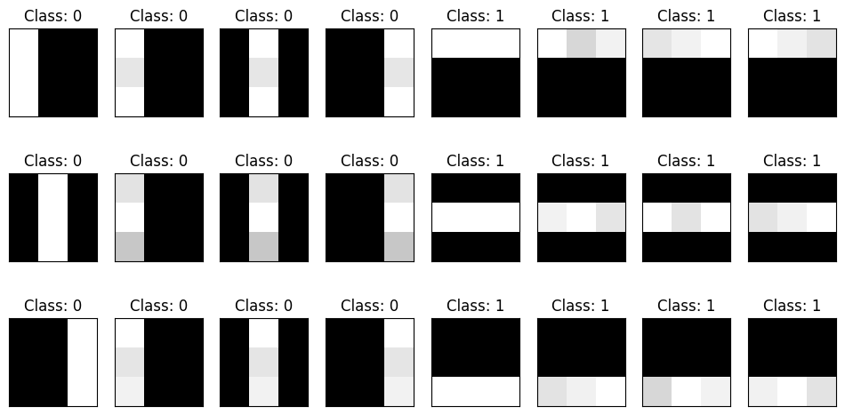
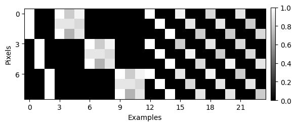

# Intro

In this tutorial we will train a neural network classifier to differentiate between images of horizontal and vertical lines. 
We will code a neural network from scratch using only Python's numpy library, and we will go through all the steps of the classic machine learning training loop comprising the forward step, backpropagation, and parameters update. 
The model will be evaluated on two validation sets.

The tutorial is inspired by S. Zhangs's [tutorial on Kaggle](https://www.kaggle.com/code/wwsalmon/simple-mnist-nn-from-scratch-numpy-no-tf-keras) [1] and is based on [resources](#further-reading) [2]-[5].

# The data

The input data $x^{[0]}$ comprises 24 3x3 pixel images grouped into two classes: vertical and horizontal lines. Each pixel assumes a grayscale value between 0 and 1:

The image below depicts the entire batch of inputs with $M=24$ examples as columns of $N=9$ pixels corresponding to a single 3x3 pixel image:

The "ground truth" vector with class labels, 0 for vertical and 1 for horizontal lines, for all examples:

Matrix $Y$ with class labels converted to [one-hot encoding](https://en.wikipedia.org/wiki/One-hot):

Rows correspond to the two classes. 
The value 1 indicates the class that a particular example is lebeled with. 
The first 12 examples belong to class 0 (vertical lines), hence the row for that class contains 1s.
These ground truth classification labeles will be used later to compare to class probabilities calculated by the network. 
The training of our NN will aim to minimize the difference between the two distributions by changing parameters of the network. 
The difference is quantified by a so-called *loss function*.

# The network

Our neural-network has a two-layer, fully connected architecture. 
The input layer $A^{[0]}$ has 9 nodes (neurons) that correspond to 9 pixels in every 3x3 input image. 
The hidden layer $A^{[1]}$ has 6 neurons with a [rectified linear unit](https://en.wikipedia.org/wiki/Rectifier_(neural_networks)) (ReLU) activation function. 
The output layer $A^{[2]}$ has 2 neurons that correspond to two classes. 
The [softmax normalization](https://en.wikipedia.org/wiki/Softmax_function) $S$ converts the output vector into a probability distribution of two possible outcomes: horizontal or vertical line.
This probability distirbution will be compared to the ground truth distribution $Y$ from the labeled data.

The scheme drawn with [NN-SVG](https://alexlenail.me/NN-SVG/index.html).

# Forward propagation

To calculate the output distribution $A^{[2]}$ from the input data $x^{[0]}$, we use the following equations:

$$
\begin{align}
z^{[1]} &= W^{[1]}  x^{[0]} + b^{[1]}\\
A^{[1]} &= \text{ReLU}(z^{[1]})\\[6pt]
z^{[2]} &= W^{[2]}  A^{[1]} + b^{[2]}\\
A^{[2]} &= S(z^{[2]})
\end{align}
$$

Where:

- $x^{[0]}$, the input vector with $N=9$ pixels of a single image, i.e., an example; dimensions 9x1.
- $W^{[1]}$, the weight matrix of the first (hidden) layer; comprises 6 rows corresponding to the number of neurons and 9 columns corresponding to the size of the input layer; dims. 6x9.
- $b^{[1]}$, bias of the first layer; a vector with 6 elements; dims. 6x1.
- $W^{[2]}$, the weight matrix of the second (output) layer; dims. 2x6.
- $b^{[2]}$, bias vector; 2 elements corresponding to two classes; dims. 2x1.

The rectifier linear unit function ReLU is defined as follows:

$$
\text{ReLU}(x) = x^+ = \max (0,x) = \begin{cases} x & \text{if $x > 0$,}\\ 0 & \text{otherwise.} \end{cases}
$$

The softmax function for a single element $x_i$ is given by:

$$
S(x_i) = \frac{e^{x_i}}{\sum_{k=1}^{C} e^{x_k}}
$$

# Loss function

The _loss function_ quantifies the disparity between two probability distributions: the calculated output and the true output given by the labeled data. 
Here, we use the [cross-entropy](https://en.wikipedia.org/wiki/Cross-entropy) loss function:

$$
\mathcal{L}(S,Y) = -\sum_{i=1}^{C} y_i \log s_i
$$

Where $Y$ is the one-hot encoded vector of the ground truth classification labels, and $S$ is the output vector $A^{[2]}$ from the softmax function (Eq. 4), which in turn depends on all the weights and biases defined in Eqs. 1-3.
The sum is over classes, which in our case goes only from 1 to 2. 

In layman's terms, $\mathcal{L}$ quantifies *divergence* between two discrete probability distributions.
If a labeled example belongs to class 0, the true probability distribution is $Y = [1, 0]$.
The cross-entropy for probability distributions $S$ calculated by the NN is then:

$$
\begin{align*}
S &= [0.1, .9]  &\rightarrow \mathcal{L}(S,Y) \approx 2.30 \\
S &= [0.5, 0.5] &\rightarrow \mathcal{L}(S,Y) \approx 0.69 \\
S &= [0.9, .1]  &\rightarrow \mathcal{L}(S,Y) \approx 0.11 \\
\end{align*}
$$

The loss function decreases, the closer the calculated probability distribution is to the ground truth.
The aim of the training (the optimization) is to make $\mathcal{L}$ as small as possible by cleverly changing network parameters. 

# Backward propagation

The loss function depends on many parameters that can be changed to minimize it.
Our small network has 74 "knobs" to manipulate ($W$ and $b$), which makes the task of minimizing $\mathcal{L}$ pretty daunting already for our tiny example. 
But fortunately, not all is hopeless. 
For the "clever changes" of network parameters we turn to calculus!

Turns out that the minima in the multidimensional landscape defined by the loss function can be identified by following the direction of the steepest gradient.
This means that for the optimization step, we need to compute gradients (more precisely, the [Jacobian](https://en.wikipedia.org/wiki/Jacobian_matrix_and_determinant)) of the loss function $\mathcal{L}$ with respect to all parameters of the model, i.e., all weights $W$ and biases $b$.

As an illustration, consider a plot of the [Himmelblau's function](https://en.wikipedia.org/wiki/Himmelblau%27s_function) that depends only on two parameters $x$ and $y$. 
It has one local maximum and four identical local minima. 
Starting from an arbitrary point we can find one of the minima by moving along the steepest gradient.
To achieve that we need to (1) calculate the gradients, i.e., partial derivatives with respect to all parameters and (2) find a way to iteratively update the parameters is a step-fashion.

## Gradients

Using the chain rule, we obtain all partial derivatives of the loss function:

$$
\begin{align*}
\frac{\partial}{\partial b^{[2]}} \mathcal{L} \left( A^{[2]} \left( z^{[2]} \left( b^{[2]} \right) \right) \right) &= \frac{\partial \mathcal{L}}{\partial A^{[2]}} \cdot \frac{\partial A^{[2]}}{\partial z^{[2]}} \cdot \frac{\partial z^{[2]}}{\partial b^{[2]}}
\\
\frac{\partial}{\partial W^{[2]}} \mathcal{L} \left( A^{[2]} \left( z^{[2]} \left( W^{[2]} \right) \right) \right) &= \frac{\partial \mathcal{L}}{\partial A^{[2]}} \cdot \frac{\partial A^{[2]}}{\partial z^{[2]}} \cdot \frac{\partial z^{[2]}}{\partial W^{[2]}}
\\
\frac{\partial}{\partial b^{[1]}} \mathcal{L} \left( A^{[2]} \left( z^{[2]} \left( A^{[1]} \left( z^{[1]} \left( b^{[1]} \right) \right) \right) \right) \right) &= \frac{\partial \mathcal{L}}{\partial A^{[2]}} \cdot \frac{\partial A^{[2]}}{\partial z^{[2]}} \cdot \frac{\partial z^{[2]}}{\partial A^{[1]}} \cdot \frac{\partial A^{[1]}}{\partial z^{[1]}} \cdot \frac{\partial z^{[1]}}{\partial b^{[1]}}
\\
\frac{\partial}{\partial W^{[1]}} \mathcal{L} \left( A^{[2]} \left( z^{[2]} \left( A^{[1]} \left( z^{[1]} \left( W^{[1]} \right) \right) \right) \right) \right) &= \frac{\partial \mathcal{L}}{\partial A^{[2]}} \cdot \frac{\partial A^{[2]}}{\partial z^{[2]}} \cdot \frac{\partial z^{[2]}}{\partial A^{[1]}} \cdot \frac{\partial A^{[1]}}{\partial z^{[1]}} \cdot \frac{\partial z^{[1]}}{\partial W^{[1]}}
\end{align*}
$$

The first two terms of all derivatives correspond to the derivative of the loss function $\mathcal{L}$ (see [the Appendix](#appendix)):

$$
\frac{\partial \mathcal{L}}{\partial A^{[2]}} \cdot \frac{\partial A^{[2]}}{\partial z^{[2]}} \coloneqq \text{d}z^{[2]} = A^{[2]} - Y
$$

Thus, we obtain:

$$
\begin{align*}
\frac{\partial \mathcal{L}}{\partial b^{[2]}} &\coloneqq  \text{d}b^{[2]} &=& \left( A^{[2]} - Y \right) \cdot 1
\\
\frac{\partial \mathcal{L}}{\partial W^{[2]}} &\coloneqq  \text{d}W^{[2]} &=& \left( A^{[2]} - Y \right) \cdot A^{[1]}
\\
\frac{\partial \mathcal{L}}{\partial b^{[1]}} &\coloneqq  \text{d}b^{[1]} &=& \left( A^{[2]} - Y \right) \cdot W^{[2]} \cdot R'(z^{[1]}) \cdot 1
\\
\frac{\partial \mathcal{L}}{\partial W^{[1]}} &\coloneqq  \text{d}W^{[1]} &=& \left( A^{[2]} - Y \right) \cdot W^{[2]} \cdot R'(z^{[1]}) \cdot x^{[0]} 
\end{align*}
$$

Or:

$$
\begin{align}
\text{d}b^{[2]} &= \text{d}z^{[2]}
\\
\text{d}W^{[2]} &= \text{d}z^{[2]} \cdot A^{[1]}
\\
\text{d}b^{[1]} &= \text{d}z^{[2]} \cdot W^{[2]} \cdot R'(z^{[1]})
\\
\text{d}W^{[1]} &= \text{d}b^{[1]} \cdot x^{[0]} 
\end{align}
$$

Where $R'$ is the derivative of the ReLU function:

$$
R'(x) = \frac{d \text{ReLU}(x)}{d x} = \begin{cases} 1 & \text{if $x > 0$,}\\ 0 & \text{otherwise.} \end{cases}
$$

## Updating parameters

We can now use the derivatives of the loss function to iteratively update the parameters: 

$$
\begin{align*}
b^{[2]} & \gets b^{[2]} &-& \alpha \, \text{d}b^{[2]} \\
W^{[2]} & \gets W^{[2]} &-& \alpha \, \text{d}W^{[2]} \\
b^{[1]} & \gets b^{[1]} &-& \alpha \, \text{d}b^{[1]} \\
W^{[1]} & \gets W^{[1]} &-& \alpha \, \text{d}W^{[1]} \\
\end{align*}
$$

The size of each update is determined by $\alpha$, the *learning rate* **hyperparameter**.

# Initialization

Weight matrices $W$ are initialized with random values drawn from a normal distribution with mean $\mu = 0$ and variance $\sigma^2 = 1 / n^{[l-1]}$, where $n^{[l-1]}$ is the number of neurons in layer $l-1$.
Biases are initialized with zeros.

This so-called Xavier initialization ensures that the mean activation across layers is zero and that the variance stays the same in every layer. 
This prevents the gradients of the network’s activations from [vanishing or exploding](https://www.deeplearning.ai/ai-notes/initialization/index.html).

# Training

After initializing the parameters, we will iteratively adjust them to minimize the loss function for the given input data.
The adjustments will follow the gradients.

The training of our neural network is a loop comprising the following steps:

1. Forward loop - calculate the output $A^{[2]}$ from the input $x^{[0]}$ using new parameters,
2. Backpropagation - calculate the gradients of the loss function at the new output,
3. Update the parameters using the gradients.

The loop is repeated for a fixed number of iterations or until desired accuracy is achieved.

## Batch

In our example, owing to the tiny size of our dataset, the loss function is minimized over the entire input, i.e., losses are calculated for every example and then summed up over all examples. 
This is unfeasible for real-life datasets, and the input must be split into batches. 
The size of a batch is a hyperparameter and its choice may heavily impact the optimization.

## The loop

The animation below shows parameter changes during the training.
Warm and cold colors corresponds to positive and negative values, respectively. 
Gray scale colors are used for matrices with only positive values; black corresponds to 0 and white to 1. 

The prediction matrix $A^{[2]}$ visualizes class probabilities calculated for every example in the input dataset. 
Red and green dots indicate incorrect and correct predictions, respectively.

## Observations

The parameter optimization achieves maximum accuracy at the 68th iteration.

# Validation

## Set 1

Similar to the training set, the validation set comprises 18 3x3 pixel images with horizontal and vertical lines, where the intensity of single pixels within lines are reduced from 1 to 0.4.

The model achieves accuracy 1 on this validation set.

## Set 2

The second validation set is just like the training set except pixel values have an additional Gaussian noise with mean 0 and standard deviation 0.2.
Values are still clipped to the [0,1] range. 

The model achieves accuracy 1.0 on this validation set.

# Further reading

[1] Samson Zhang, _Simple MNIST NN from scratch (numpy, no TF/Keras)_, Kaggle, 2018; [HTML link](https://www.kaggle.com/code/wwsalmon/simple-mnist-nn-from-scratch-numpy-no-tf-keras).

[2] Jeremy Howard and Sylvain Gugger, _Practical Deep Learning for Coders: Chapter 17 - A Neural Net from the Foundations_, fast.ai; [HTML link](https://fastai.github.io/fastbook2e/foundations.html).

[3] Shivam Mehta, _Deriving categorical cross entropy and softmax_, 2023; [HTML link](https://shivammehta25.github.io/posts/deriving-categorical-cross-entropy-and-softmax/).

[4] Eli Bendersky, _The Softmax function and its derivative_, 2016; [HTML link](https://eli.thegreenplace.net/2016/the-softmax-function-and-its-derivative/).

[5] Katanforoosh & Kunin, _Initializing neural networks_, deeplearning.ai, 2019; [HTML link](https://www.deeplearning.ai/ai-notes/initialization/index.html)

# Appendix

## Derivative of the loss function

The cross-entropy loss function:

$$
\mathcal{L}(S, Y) = -\sum_{i=1}^{C} y_i \log s_i
$$

where $i$ indexes all the oputput classes, $C$.
<!---
Since $y_i$ is the one-hot encoded true probability, $y_i = 1$ for only a single index $i$. 
-->

The softmax function for a single vector element $x_i$ is given by:

$$
s_i = \frac{e^{x_i}}{\sum_{k=1}^{C} e^{x_k}}
$$

Thus the $\log s_i$:
$$
\log s_i = x_i - \log \left( \sum_{k=1}^{C} e^{x_k} \right)
$$

And its partial derivative:

$$
\frac{\partial}{\partial x_k} \left( \log s_i \right) = \frac{\partial x_i}{\partial x_k} - \left( \sum_{k=1}^{C} e^{x_k} \right)^{-1} \cdot \frac{\partial}{\partial x_k} \left( \sum_{k=1}^{C} e^{x_k} \right)
$$

The first term on the r.h.s. equals to 1 only if $i = j$, and 0 otherwise, thus $\partial x_i / \partial x_k = \delta_{ik}$. 
Since $\partial e^{x_k} / \partial x_k = e^{x_k}$, the entire second term is simply the softmax function of $x_k$.
Thus we obtain:

$$
\frac{\partial}{\partial x_k} \left( \log s_i \right) = \delta_{ik} - s_k
$$

From this we obtain the elements of the Jacobian of the softmax function:

$$
\frac{\partial}{\partial x_k} \left( \log s_i \right) = \frac{1}{s_i} \frac{\partial s_i}{\partial x_k} \Longrightarrow \frac{\partial s_i}{\partial x_k} = s_i ( \delta_{ik} - s_k ) 
$$

Thus, the partial derivative of the loss function:

$$
\begin{align*}
\frac{\partial}{\partial x_k} \mathcal{L}(S, Y) &= -\sum_{i=1}^{C} y_i \frac{1}{s_i} \frac{\partial s_i}{\partial x_k} \\
&= -\sum_{i=1}^{C} y_i \delta_{ik} + \sum_{i=1}^{C} y_i s_k \\
&= s_k - y_k && \text{since $y_i$=1 only for $i=k$}
\end{align*}
$$